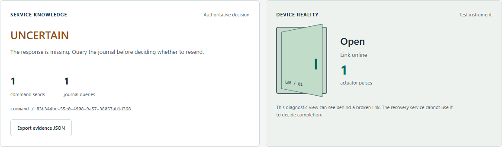
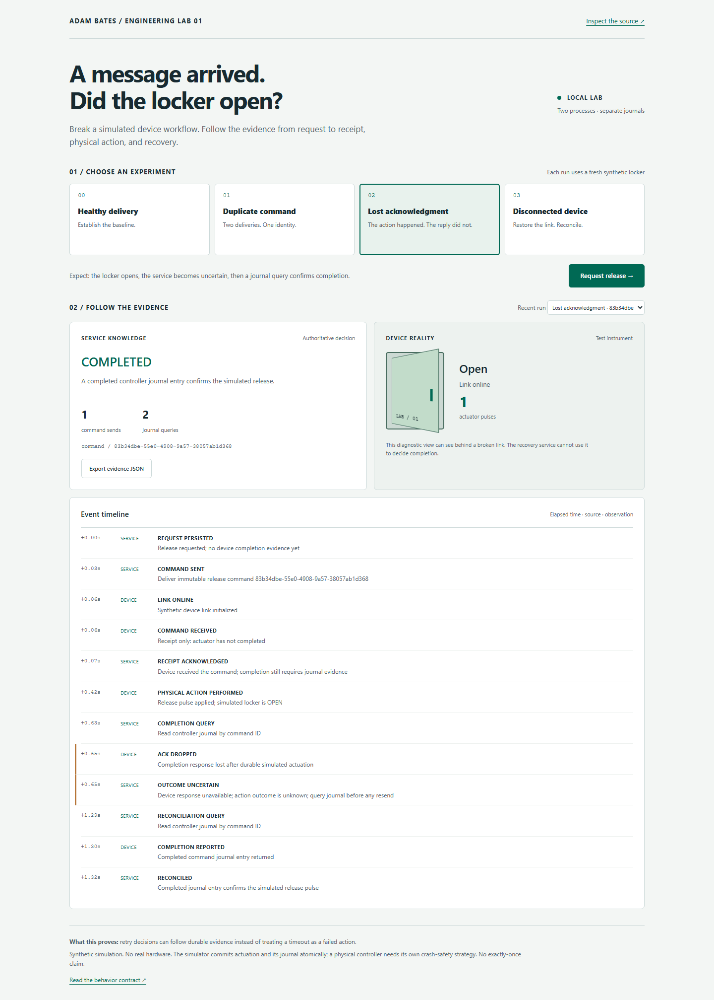

# Device Recovery Lab

**I built this lab to show what recovery requires when a device acts but its response disappears.**

My professional work spans distributed services, customer-facing device
interfaces, and testing tools. Here, I bring those concerns together in a small,
independent experiment: request a simulated parcel-locker release, introduce a
communication failure, and follow the evidence the service uses to recover.

I keep message receipt separate from completion because a device can accept a
command before it acts, and it can act before the service learns the result.
The interface makes that gap visible.



*The device panel is diagnostic instrumentation. My recovery service must query
the device journal; it cannot use this panel as completion evidence.*

## Three failures to explore

| Inject a failure | What to inspect |
| --- | --- |
| **Duplicate command** | Two deliveries share one command ID. The controller suppresses the duplicate and records one pulse. |
| **Lost acknowledgment** | The device acts, then its completion response is dropped. The service enters UNCERTAIN and reconciles from the journal without resending. |
| **Disconnected device** | The service backs off while the device remains closed. Restore the link and watch it query the journal before retrying the same command. |

<details>
<summary>See a complete captured run and its recovery timeline</summary>



My browser tests captured these screenshots from the running lab. The timeline
follows the lost acknowledgment through uncertainty to journal reconciliation.

</details>

**Inspect the [behavior contract](docs/behavior.md), [recovery code](lab/service.py),
or [recorded experiments](measurements/README.md).** The contract defines the
expected outcomes independently of the implementation.

## Run it

Requires **Python 3.11+ with SQLite** and a browser. No runtime package install,
Docker, broker, cloud account, API key or paid service.

```sh
git clone https://github.com/B8Z/device-recovery-lab.git
cd device-recovery-lab
python run.py
```

Open **http://127.0.0.1:8765**. If your system calls Python `python3`, use that
command instead; Windows also supports `py -3 run.py`.

1. Start **Healthy delivery** and select **Request release**. Inspect the receipt,
   later physical pulse, and completed journal evidence.
2. Select **Lost acknowledgment**, request another release, and inspect the
   `ACK DROPPED → OUTCOME UNCERTAIN → RECONCILED` sequence. The pulse count stays one.
3. Select **Disconnected device**, request release, then **Reconnect device**.
   Leaving it disconnected eventually pauses automatic recovery; reconnect also
   resumes reconciliation.
4. Use **Export evidence JSON** or **Recent run** to inspect and compare runs.

Stop both processes with Ctrl+C. Journals persist in `.lab/` (ignored by Git).
For a fresh session use `python run.py --data-dir .lab/fresh`. Busy ports can be
changed with `--port 8875 --device-port 8876`. Only loopback connections are served.

## How I designed it

I chose two Python processes with separate SQLite journals so a visitor can
inspect process boundaries and persistent recovery state without installing a
broker. The service records its intent before I/O. If the outcome is uncertain,
it queries the device journal using the same command ID before considering a
resend. On the device side, that ID ties duplicate deliveries to the same action.

Java/Spring Boot and Kafka are part of my professional background, but a broker
would add setup without resolving the question this experiment asks: did the
physical action complete? I describe the tradeoffs and a possible later transport
experiment in the [architecture decision](docs/architecture.md).

```text
Browser → service + intent journal → HTTP → simulated device + execution journal
               ↓ recovery queries                     ↓ delayed release pulse
            event timeline ← receipt / completion / injected faults
```

The service has one recovery worker; the device has a separate execution worker
and database. Each run uses one fresh synthetic locker and one release command.

### Where to inspect my implementation

- [Behavior contract](docs/behavior.md): expected outcomes written before implementation.
- [Recovery controller](lab/service.py): durable intent before I/O, bounded backoff,
  ambiguous outcomes, journal-first retries and explicit attention state.
- [Device journal](lab/device.py): asynchronous receipt versus execution, durable
  duplicate suppression, and an actual dropped HTTP response.
- [Acceptance tests](tests/test_recovery.py): pulse-count invariants, restarts,
  conflicts, concurrent requests, failure budgets and HTTP boundaries.
- [Architecture and alternatives](docs/architecture.md): why this slice uses two
  Python processes, HTTP and SQLite instead of requiring Spring/Kafka.
- [Verification guide](docs/testing.md) and [reproducible observations](measurements/README.md).

## Tests and measurements

```sh
python -m unittest -v
```

I check correctness with 12 Python tests and six Playwright browser tests,
including duplicate suppression, process restarts, recovery budgets, and the
visible user journey. The browser checks are optional; setup and coverage are in
[docs/testing.md](docs/testing.md).

Separately, I measure whether each failure adds command sends, journal queries,
or actuator pulses compared with healthy delivery. My measurement script also
records local end-to-end observation times under the same settings for all four
scenarios. The raw data includes the tested commit and environment. Timings
include polling and intentional fault delays, so I don’t treat them as production
latency measurements.

In my [October 3, 2026 recorded run](measurements/README.md#recorded-run--october-3-2026),
all 32 measured trials (eight per scenario) completed with one simulated actuator
pulse each. Lost-ack trials added a journal query without a second command send.
I retain the raw observations, warmups, configuration, and variability so the
result can be inspected and repeated. This finite sample supports these settings;
it does not establish a universal execution guarantee.

## Limits and next questions

**Receiving a message is not completing a physical action.** I made the
simulator’s pulse counter and completion record atomic in SQLite. Real hardware
usually cannot join that transaction. Controller journal loss, a crash between
motor movement and durable recording, and ambiguous sensor readings need
additional device-specific safeguards or human intervention. I don’t claim
exactly-once physical execution.

Completed here: three injected failures, healthy baseline, restartable journals,
bounded recovery, visible evidence, automated acceptance and browser checks.
Future experiments, **not implemented**: controller storage loss, actuator/journal
crash gaps, multiple devices/controllers, and alternative broker transports.

I created this independent personal demonstration with synthetic data in October
2026. It contains no employer code, interfaces, or incident reconstructions, and
I haven’t deployed it as a production system. I used AI tools during development;
the published contract, executable checks, and recorded observations make the
result inspectable.

MIT licensed. Runtime uses the Python standard library; optional browser tests
use Playwright (Apache-2.0). See [LICENSE](LICENSE).
