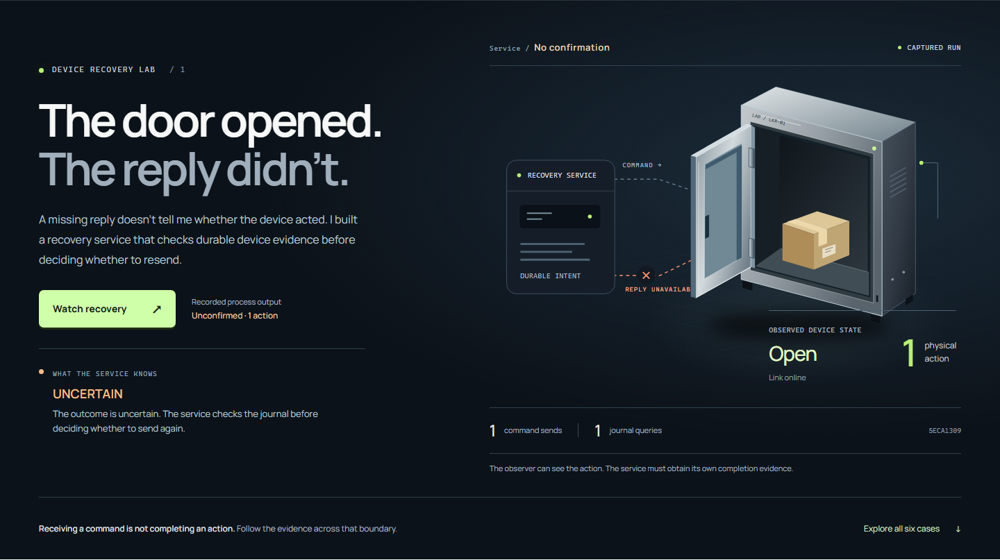

# Device Recovery Lab

**I built this lab to make two decisions inspectable: when a service has enough
evidence to claim completion, and how it keeps recovering when other work is slow.**

Request a simulated parcel-locker release, break communication, and inspect the
service's decision alongside the device's actual recorded behavior. Then compare
one recovery worker with four under the same independently injected faults.

[**Watch the recovery →**](https://b8z.github.io/device-recovery-lab/)
· [Run the processes locally](#run-it) · [Read the controlled experiment](docs/workload.md)

[](https://b8z.github.io/device-recovery-lab/)

*The illustration follows real saved API snapshots from the simulator. It is not
physical hardware. The diagnostic instrument shows what happened; the service
must obtain completion evidence through the controller protocol.*

## Break a specific assumption

| Condition | Expected behavior | Evidence to inspect |
| --- | --- | --- |
| Duplicate command | Same ID returns the existing operation; no second pulse | Duplicate suppression and one physical-action event |
| Completion response lost | Preserve uncertainty; query before considering a resend | One send, another journal query, one pulse |
| Device disconnected | Bounded backoff; reconcile after reconnect | Missing journal permits sending the same immutable command |
| Controller dies before or after its pulse | Both incomplete journals become `IN_DOUBT`; require inspection | Zero versus one pulse, neither inferred from receipt |
| Service dies during an outstanding response | Abandoned ownership expires; successor reconciles | Real process kill, preserved journal, one pulse |
| Many queued operations with external faults | Isolate blocked work with bounded concurrency | Matched one/four-worker workloads and every raw observation |

Receiving a message is not completing a physical action. If the controller dies
between acting and recording completion, a retry could repeat an action and a
success claim could invent one. I keep that uncertainty explicit.

[](https://b8z.github.io/device-recovery-lab/#boundary)

## What makes the concurrent recovery work

The service persists intent before I/O. Workers claim durable queue entries with
an owner token, lease expiry, and incremented epoch. Every worker state/event write
checks that ownership in the same transaction, so an expired worker cannot
regress the journal or release its successor's claim. The controller still needs
durable duplicate suppression: a lease cannot cancel a network request already sent.

The workload uses a separate HTTP proxy to delay, drop, and duplicate traffic.
The service and controller do not choose their own faults. A separate observer
checks physical-action, completion-report, and service-decision evidence.

A deliberately broken worker that declares completion without querying the
controller is retained as a **negative test**. The experiment must reject it.
This checks the acceptance oracle itself, rather than accepting a green status.

**Open the implementation:**

- [Behavior contract](docs/behavior.md) and [concurrency contract](docs/workload-contract.md): independently defined outcomes.
- [Recovery controller](lab/service.py): journal-first recovery, claims, epochs, fenced writes and bounded retry budgets.
- [Ownership tests](tests/test_ownership.py): competing claims, stale owners, stale snapshots and existing-journal migration.
- [External fault tests](tests/test_external_faults.py): real transport faults, actual service termination and the deliberately broken worker.
- [Controller crash tests](tests/test_crash_boundary.py): physical uncertainty that automatic retries cannot resolve.
- [Experiment script](scripts/workload.py): matched workloads, retained failures and reproducible observations.

## What I measured

At source `80215b81d2ae2ab61b67a8eb289692c09ead875b`, all **864 measured
operations in 36 batches** passed the recorded correctness checks. Each batch
contained 24 operations. I compared one and four workers using three seeds and
three timing repetitions under both clean and mixed-fault workloads.

For mixed faults, median batch completion was **5.916 s with one worker and
2.775 s with four**. Four workers finished faster in eight of nine matched pairs;
the exception took **8.009 s versus 5.857 s**. I retain that run and do not claim
a consistent speedup. These are finite, single-host observations that include
queue waiting and intentional delays, not production latency or fleet capacity.

[**Inspect the completion curves and the slower run →**](https://b8z.github.io/device-recovery-lab/#workload)

The [method and full results](docs/workload.md) specify environment, timing
boundaries, seeds, warmup, repetitions, aggregation and limitations.
[Raw data](measurements/concurrency.json) retains every operation and proxy event.
The earlier [four-scenario experiment](measurements/README.md) remains attached
to its original source revision; I have not relabeled it as a new measurement.

## Run it

Requires **Python 3.11+ with SQLite** and a browser. No runtime package install,
Docker, broker, cloud account, API key or paid service.

```sh
git clone https://github.com/B8Z/device-recovery-lab.git
cd device-recovery-lab
python run.py
```

Open **http://127.0.0.1:8765**. Use `python3` if that is your Python command;
Windows also supports `py -3 run.py`.

1. Select **Healthy delivery**, then **Request release**. Receipt precedes the
   physical pulse and confirmed completion.
2. Select **Lost acknowledgment** and request another release. Inspect uncertainty,
   reconciliation and the unchanged pulse count of one.
3. Select **Disconnected device**, request release, then **Reconnect device**.
4. Compare **Crash before pulse** and **Crash after pulse**. The launcher restarts
   the controller; both runs require inspection, with zero and one pulses.
5. Use **Export evidence JSON** or **Recent run** to inspect previous observations.

The default is four recovery workers; use `--workers 1` for a single worker.
Stop with Ctrl+C. Journals persist in the ignored `.lab/` directory. Use
`--data-dir .lab/fresh` for a fresh session and `--port 8875 --device-port 8876`
if the default ports are occupied. Servers bind only to loopback.

```sh
python -m unittest -v
python scripts/workload.py --check
python scripts/workload.py --output .verify/my-workload.json
```

The first two commands check correctness. The last runs the full experiment from
a clean checkout and records the tested commit; allow several minutes.
Optional browser verification and clean-environment evidence are in
[the testing guide](docs/testing.md).

## Architecture and limits

```text
Browser → service + durable queue → HTTP → controller + execution journal
                    ↓                             ↓
          owned recovery workers             simulated pulse

Workload experiment inserts a separate fault proxy at the HTTP boundary.
The observer reads retained evidence; it cannot authorize service completion.
```

I use Python and separate SQLite journals to expose process boundaries and
persistent state with little setup. Java/Spring Boot and Kafka are part of my
professional background. Adding a broker here would introduce another delivery
layer without resolving the physical-action boundary. The
[architecture decisions](docs/architecture.md) explain that choice and alternatives.

Completed: six inspectable workflows, real process-crash tests, durable worker
ownership, externally injected faults, matched workload measurements and browser
verification. The public viewer plays captured output; the local interface runs
the actual processes.

Not implemented: physical sensing or operator resolution, controller storage-loss
recovery, sustained admission/backpressure, multi-host coordination, clock-jump
handling, or broker transport. Every operation uses a fresh synthetic locker;
this does not model conflicting actions on the same physical device. I make no
exactly-once physical execution, power-loss safety or production deployment claim.

This is independent personal work created in October 2026 with synthetic data.
It contains no employer code, interfaces, or incident reconstructions. I used AI
assistance during development; the contracts, tests, source and raw observations
make the result inspectable.

MIT licensed. The viewer uses Manrope under SIL OFL 1.1; optional browser tests use
Playwright under Apache-2.0. See [LICENSE](LICENSE) and
[third-party notices](THIRD_PARTY_NOTICES.md).
