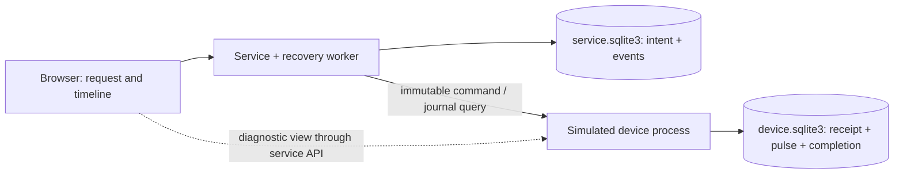

# ADR-001: Make recovery evidence visible with two small processes

**Status:** Accepted · **Date:** October 3, 2026 · **Owner:** Adam Bates

## Context and decision

The first release must distinguish message delivery from physical completion and
expose three fault paths on an ordinary laptop. It uses Python 3.11+ standard
library servers, HTTP, two independent SQLite databases, and plain browser
JavaScript. No packages are required to run it. Playwright is an optional test dependency.

The service's `runs` table is a durable work queue. A single worker owns dispatch.
It commits dispatch intent **before** sending. After a crash it queries the
controller by the same ID before deciding whether to resend. Only an explicit
absent-journal response allows redispatch. SQLite uniqueness constraints and
transactions serialize concurrent duplicate requests; database files are never
shared between the two processes.

The simulator initially records RECEIVED and sends a receipt. A separate worker
later records a simulated pulse and COMPLETED in one transaction. The lost-ack
fault closes an actual HTTP connection when that completed journal entry is first
requested. The service records UNCERTAIN and reconciles on a later query.

## States and protocol

`QUEUED → ACCEPTED → COMPLETED` is the healthy path. A missing response means
`UNCERTAIN`; unavailable responses consume a bounded exponential-backoff budget.
Six consecutive failures pause recovery at `NEEDS_ATTENTION`. Thirty completion
queries without completion also pause it. A visitor can resume journal queries;
resuming a completed operation cannot execute it again. Reconnect restores a
per-experiment simulated link and resumes exhausted recovery.

| Endpoint | Meaning |
| --- | --- |
| `POST /api/runs` with UUID `id` and `scenario` | Persist one release intent; HTTP 202 is not completion |
| `GET /api/runs/{id}` | Service evidence plus clearly labeled diagnostic device view |
| `POST /api/runs/{id}/reconnect` with `{}` | Lab-only link restoration |
| `POST /api/runs/{id}/resume` with `{}` | Resume a paused reconciliation budget |
| Device `POST /commands` | Durable receipt; duplicate same ID returns existing entry |
| Device `GET /commands/{id}` | Controller execution evidence, subject to injected link faults |

Each run has a fresh synthetic locker and one immutable release command. No
operation supersedes another on the same locker. Event sequence numbers are
local to a process; the combined display sorts wall-clock timestamps on this one
machine. It is a diagnostic view, not a globally ordered event log.

## Alternatives and tradeoffs

| Option | Benefit | Reason for first-release choice |
| --- | --- | --- |
| Python + HTTP + SQLite | Inspectable transport and persistence; no runtime package install | Selected for a complete, inexpensive local experiment |
| Java/Spring + Kafka | Uses a stack I have worked with professionally; broker redelivery and consumer offsets | Adds JVM/broker setup without resolving the actuator boundary; a possible later transport experiment |
| Single in-memory simulation | Fastest setup and deterministic clocks | Cannot show process isolation, restart persistence or real response loss |
| MQTT/device broker | Familiar device messaging semantics | Useful later, but still cannot make a physical effect atomic with broker delivery |

Kafka acknowledgment or committed consumer offsets would establish a messaging
fact, not proof of an actuator's physical effect. Adding a broker does not remove
the need for the controller journal, reconciliation, and ambiguous-outcome policy.

## Boundaries and consequences

- One service worker and one simulated controller; no leader election, failover,
  multi-host clocks, message broker, high availability or throughput claim.
- Persistence covers process restart, not controller storage loss. An empty
  replacement journal could authorize an unsafe repeat on real hardware.
- A real actuator can move between writing its intent and completion record.
  That crash gap needs device-specific sensing, durable controller semantics,
  safe idempotent operations or manual intervention. This demo does not solve it.
- The diagnostic `/lab` endpoints intentionally bypass the simulated broken link
  for visitor inspection. The recovery algorithm uses only `/commands`.
- Standard-library HTTP servers are local development servers. Both bind to
  loopback; Host and Origin checks reject other origins. There is no production
  authentication or deployment configuration.
- Journals grow with experiments. Stop the lab and use a new `--data-dir` for a
  fresh session; retained journals make prior runs inspectable.
- Backoff uses wall time for persisted deadlines; clock jumps are not modeled.

## Sources

[Python SQLite transactions](https://docs.python.org/3/library/sqlite3.html#transaction-control)
and [HTTP server limitations](https://docs.python.org/3/library/http.server.html),
consulted October 3, 2026. The behavior contract remains the acceptance oracle.
