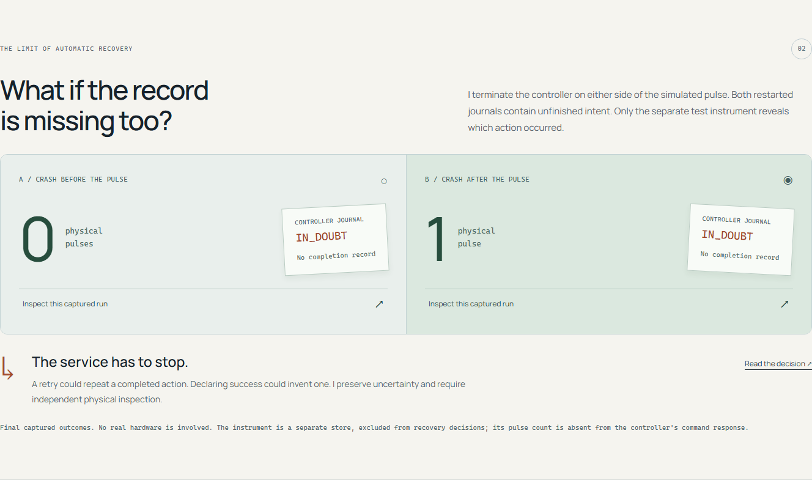

# When the correct recovery decision is to stop

I added this experiment because recovering from a lost response is only half of
the device problem. A completed journal entry can resolve a missing response.
If the controller dies before writing that entry, the evidence is weaker.

**[Inspect the captured after-pulse crash](https://b8z.github.io/device-recovery-lab/#crash_after)**
or run `python run.py` and select either crash scenario. The launcher restarts the
actual device process after the deliberate exit. No hardware is connected.

## The experiment

Both runs persist execution intent. One process exits immediately before the
simulated pulse. The other applies the pulse to a separate instrument store and
then exits before recording completion. [`os._exit(73)`](https://docs.python.org/3/library/os.html#os._exit) terminates the process
without a graceful shutdown or a Python exception handler completing the action.

| Observation after restart | Before-pulse crash | After-pulse crash |
| --- | --- | --- |
| Controller journal | IN_DOUBT | IN_DOUBT |
| Completion entry | Absent | Absent |
| Diagnostic instrument | 0 pulses | 1 pulse |
| Service decision | NEEDS_INSPECTION | NEEDS_INSPECTION |
| Automatic second command | None | None |

The command response contains its ID and journal state. The instrument's pulse
count is deliberately excluded. This makes the distinction observable: **the
visitor has evidence that the recovery controller does not have**. Event times
are diagnostic observations on one machine, not a distributed ordering guarantee.

## Why I preserve uncertainty

If I retry both commands, the after-pulse run risks a second physical action.
If I declare both complete, the before-pulse run reports work that never happened.
Neither decision follows from the journal. I therefore preserve the unresolved
state and block the ordinary resume endpoint. More queries cannot reconstruct
evidence that was never committed.

The stop is conservative: a process can also die after intent and before any
action starts. Without another trustworthy observation, I accept that some
unperformed actions require inspection rather than risk repeating performed ones.

Real recovery would depend on the device contract. A trustworthy position sensor
could support an independently verified state transition; an idempotent target-state
command might safely converge; some mechanisms require an operator. I do not
implement those options here because this release has no such sensor or hardware
contract. A new command ID is not a substitute for resolving the previous action.

## Where the evidence lives

- [Execution boundary and restart handling](../lab/device.py): durable intent,
  separate instrument transaction, abrupt exit, IN_DOUBT on startup.
- [Recovery decision](../lab/service.py): journal response selects
  NEEDS_INSPECTION; no diagnostic reads in the decision path.
- [Process tests](../tests/test_crash_boundary.py): check the real exit code,
  intent on disk, both pulse counts, duplicates, service/controller restart,
  rejected resume, and another command surviving the crash. Removing instrument
  data does not change the journal response or recovery decision.
- [Browser checks](../tests/browser/journey.spec.js): exercise the launcher,
  visible outcome, evidence export, and HTTP 409 on resume.
- [Captured JSON](../demo/traces.json): one real run per scenario with source
  commit, timestamp, Python version and observation settings.

These are correctness experiments, not performance measurements. The older
messaging benchmark retains its original tested revision and four-scenario
workload. It does not measure the new process-crash paths. Abrupt process exit
also does not establish resilience to power loss, failed storage, journal
corruption, or an incorrectly reporting physical sensor.
